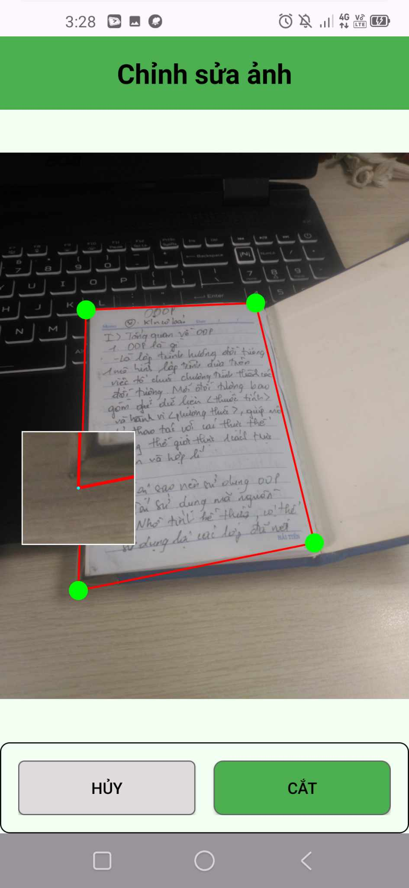
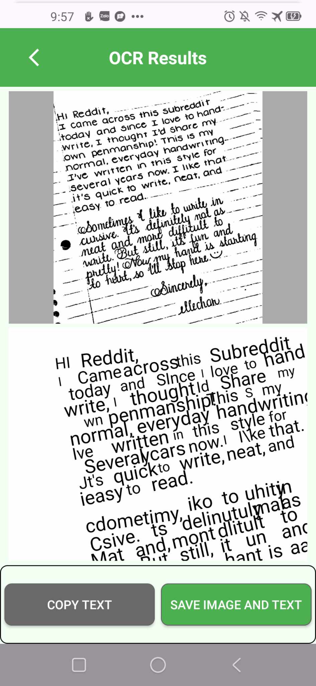

# Camera Scanner App

Ứng dụng quét tài liệu với AI nhận diện realtime và xử lý ảnh chuyên nghiệp.

<p align="center">
  
</p>

<div align="center">
  <video src="images/demo_app.mp4" controls width="600"></video>
</div>

## Tính năng

- 📷 **Camera Scanner** - Nhận diện khung tài liệu realtime bằng OpenCV
- ✂️ **Auto Crop** - Tự động crop theo khung nhận diện hoặc Google ML Kit Text
- 🔄 **Xử lý ảnh** - Xoay, crop, tạo PDF, OCR, ký tên số
- 📂 **Quản lý ảnh** - Lưu trữ và tổ chức ảnh đã quét
- 🆔 **Auto-capture ID Card** - Tự động chụp khi phát hiện thẻ ID

## Cấu trúc Activities

### MainActivity

<table style="width:100%; border:none;">
  <tr>
    <td style="width:200px; text-align:left; vertical-align:middle;">
      
    </td>
    <td style="text-align:left; vertical-align:middle;">
      <h4></h4>
      <ul>
        <li>Hiển thị danh sách file PDF, JPG, OCR đã lưu trong bộ nhớ</li>
        <li>Nút "QUÉT NGAY BÂY GIỜ" mở camera scanner</li>
        <li>Tìm kiếm ảnh đã lưu với real-time filtering</li>
        <li>Tab navigation giữa PDF files và OCR paired items</li>
        <li>Activity Me chứa logic đổi giao diện sáng tối và ngôn ngữ (vi và en)</li>
      </ul>
    </td>
  </tr>
</table>

### CameraActivity

<table style="width:100%; border:none;">
  <tr>
    <td style="width:200px; text-align:left; vertical-align:middle; padding-right: 20px; white-space: nowrap;">
      
    </td>
    <td style="text-align:left; vertical-align:middle;">
      <h4></h4>
      <ul>
        <li><b>OpenCV realtime detection</b> - Nhận diện khung tài liệu trong thời gian thực</li>
        <li><b>CameraX integration</b> - Preview, ImageAnalysis, ImageCapture với lifecycle management</li>
        <li><b>Auto crop</b> - Tự động cắt và tạo khung cắt theo khung phát hiện</li>
        <li><b>Fallback</b> - Dùng ML Kit Text Detection nếu không phát hiện được khung</li>
        <li><b>ID Card Mode</b> - Tự động chụp ảnh khi phát hiện khung có tỷ lệ thẻ ID (1.5-1.85)</li>
        <li><b>Frame processing optimization</b> - Xử lý 1/3 frame để tối ưu performance</li>
      </ul>
    </td>
  </tr>
</table>

### PDFGroupActivity

<table style="width:100%; border:none;">
  <tr>
    <td style="width:200px; text-align:left; vertical-align:middle;">
      
    </td>
    <td style="text-align:left; vertical-align:middle;">
      <h4></h4>
      <ul>
        <li>Hiển thị tất cả ảnh đã qua crop</li>
        <li>Nút thêm ảnh mới (quay lại camera scanner)</li>
        <li>Lưu ảnh thành file PDF với nhiều style khác nhau</li>
        <li>Xóa ảnh tùy chọn</li>
        <li>Quản lý nhóm ảnh để tạo PDF</li>
      </ul>
    </td>
  </tr>
</table>

### ImagePreviewActivity
<table style="width:100%; border:none;">
  <tr>
    <td style="width:200px; text-align:left; vertical-align:middle; padding-right: 20px;">
      
    </td>
    <td style="text-align:left; vertical-align:middle;">
      <h4></h4>
      <ul>
        <li><b>Xoay ảnh</b> - 90°, 180°, 270° hoặc góc tùy chỉnh</li>
        <li><b>Crop ảnh</b> - Cắt tự do hoặc theo tỷ lệ chuẩn</li>
        <li><b>Tạo PDF</b> - Chuyển đổi ảnh thành PDF</li>
        <li><b>OCR</b> - Trích xuất text bằng Google ML Kit</li>
        <li><b>Ký tên</b> - Thêm chữ ký số lên ảnh</li>
        <li><b>Lưu ảnh</b> - Lưu ảnh thành file JPG</li>
        <li><b>Chia sẻ</b> - Chia sẻ ảnh qua các ứng dụng khác</li>
      </ul>
    </td>
  </tr>
</table>

### CropActivity
<table style="width:100%; border:none;">
  <tr>
    <td style="width:200px; text-align:left; vertical-align:middle; padding-right: 20px;">
      
    </td>
    <td style="text-align:left; vertical-align:middle;">
      <h4></h4>
      <ul>
        <li><b>OpenCV perspective transform</b> - Biến đổi phối cảnh ảnh theo khung nhận diện</li>
        <li><b>EXIF orientation handling</b> - Xử lý orientation tự động từ metadata ảnh</li>
        <li><b>ML Kit Text Detection</b> - Fallback khi không phát hiện được khung</li>
        <li><b>Auto-crop optimization</b> - Tối ưu kích thước và chất lượng ảnh</li>
      </ul>
    </td>
  </tr>
</table>

### OCRActivity
<table style="width:100%; border:none;">
  <tr>
    <td style="width:200px; text-align:left; vertical-align:middle; padding-right: 20px;">
      
    </td>
    <td style="text-align:left; vertical-align:middle;">
      <h4></h4>
      <ul>
        <li><b>Google ML Kit Text Recognition</b> - OCR chính xác với nhiều ngôn ngữ</li>
        <li><b>Image preprocessing</b> - Tăng độ tương phản, độ sáng để cải thiện OCR</li>
        <li><b>Copy to clipboard</b> - Sao chép text đã nhận diện</li>
        <li><b>Save OCR result</b> - Lưu ảnh và text thành cặp OCR</li>
      </ul>
    </td>
  </tr>
</table>

## Công nghệ

- **OpenCV 4.11.0** – Computer Vision và xử lý ảnh (contour detection, transform, filter, …)
- **Google ML Kit** – Nhận diện văn bản (Text Recognition)on-device
- **CameraX 1.4.2** – Xử lý camera với quản lý vòng đời (Lifecycle-aware), hỗ trợ PreviewView
- **Thư viện khác**
    - **Glide** – Tải và hiển thị ảnh hiệu quả, hỗ trợ cache mạnh mẽ
    - **ExifInterface** – Đọc và xử lý thông tin orientation của ảnh
    - **android-image-cropper** – Xây dựng nhanh UI crop ảnh tùy chỉnh
    - **AmbilWarna** – Chọn màu cho chữ ký số

## Nền tảng & Build
- **Java 24** – Ngôn ngữ lập trình chính
- **ViewBinding** – Liên kết view an toàn và nhanh chóng
- **compileSdk 35** – SDK biên dịch
- **minSdk 24** – Yêu cầu tối thiểu (Android 7.0+)
- **targetSdk 35** – SDK mục tiêu

## Dependencies

```gradle
// Core CameraX
implementation("androidx.camera:camera-camera2:1.4.2")
implementation("androidx.camera:camera-lifecycle:1.4.2")
implementation("androidx.camera:camera-view:1.4.2")
implementation("androidx.camera:camera-core:1.4.2")
implementation("androidx.camera:camera-extensions:1.4.2")

// Computer Vision & AI
implementation("org.opencv:opencv:4.11.0")
implementation("com.google.mlkit:text-recognition:16.0.1")

// Image Processing
implementation("androidx.exifinterface:exifinterface:1.4.1")
implementation("com.vanniktech:android-image-cropper:4.5.0")

// UI & Utilities
implementation("com.github.bumptech.glide:glide:4.12.0")
implementation("com.github.yukuku:ambilwarna:2.0.1")
```

## Permissions

```xml
<uses-permission android:name="android.permission.CAMERA" />
<uses-permission android:name="android.permission.READ_EXTERNAL_STORAGE" android:maxSdkVersion="32" />
<uses-permission android:name="android.permission.WRITE_EXTERNAL_STORAGE" android:maxSdkVersion="28" />
<uses-permission android:name="android.permission.READ_MEDIA_IMAGES" />
```

## Flow hoạt động

1. **MainActivity** → Danh sách file → **CameraActivity** (Scanner)
2. **CameraActivity** → OpenCV detection → **CropActivity** (Auto-crop)
3. **CropActivity** → **ImagePreviewActivity** (Editor)
4. **ImagePreviewActivity** → **OCRActivity** (Text recognition) hoặc **SignatureActivity** (Ký tên)
5. **PDFGroupActivity** → Tạo PDF từ nhóm ảnh

## Cấu trúc Project

```
app/src/main/java/com/example/camerascanner/
├── activitymain/          # MainActivity, quản lý file chính
├── activitycamera/        # CameraActivity với OpenCV + CameraX
├── activitycrop/          # CropActivity với perspective transform
├── activitypdf/           # Tạo và quản lý PDF
├── activitypdfgroup/      # Quản lý nhóm ảnh và tạo PDF
├── activityocr/           # OCR với ML Kit
├── activitysignature/     # Chữ ký số với custom signature view
└── activityimagepreview/  # Xem trước và chỉnh sửa ảnh
```

## Tính năng nổi bật

- **Realtime document detection** với OpenCV
- **Auto-capture ID cards** dựa trên aspect ratio
- **Multi-language support** (Tiếng Việt + English)
- **Dark/Light theme** switching
- **Advanced image processing** với OpenCV
- **Professional PDF generation** với custom styling
- **Signature overlay** với color customization
- **Memory optimization** với bitmap recycling
