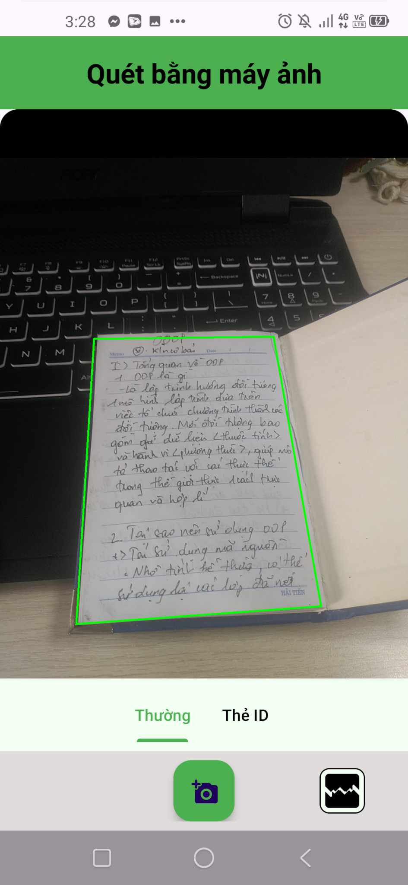
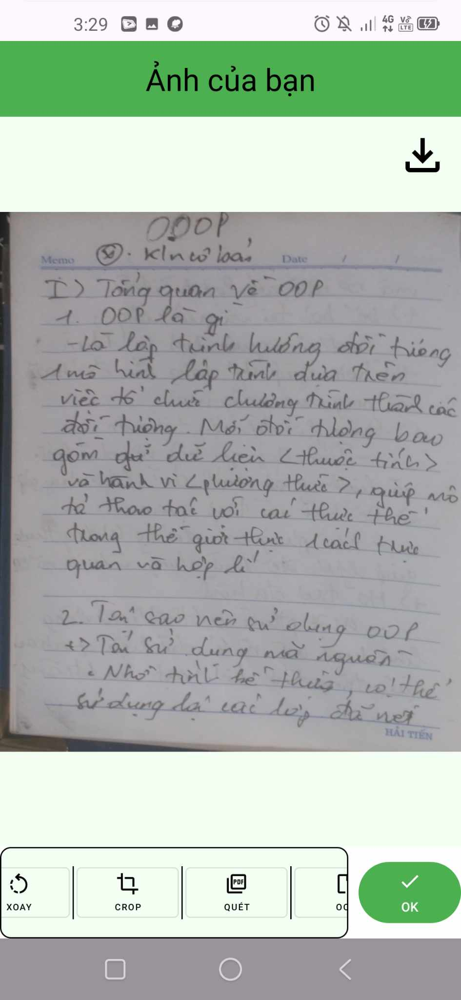

# Camera Scanner App

Ứng dụng quét tài liệu với AI nhận diện realtime và xử lý ảnh chuyên nghiệp.

<p align="center">
  
</p>

## Tính năng

- 📷 **Camera Scanner** - Nhận diện khung tài liệu realtime bằng OpenCV
- ✂️ **Auto Crop** - Tự động crop theo khung nhận diện hoặc Google ML Kit Text
- 🔄 **Xử lý ảnh** - Xoay, crop, tạo PDF, OCR, ký tên số
- 📂 **Quản lý ảnh** - Lưu trữ và tổ chức ảnh đã quét

## Cấu trúc Activities

### MainActivity

<table style="width:100%; border:none;">
  <tr>
    <td style="width:200px; text-align:left; vertical-align:middle;">
      
    </td>
    <td style="text-align:left; vertical-align:middle;">
      <h4>MainActivity</h4>
      <ul>
        <li>Hiển thị danh sách file PDF ,JPG, OCR đã lưu trong bộ nhớ</li>
        <li>Nút "QUÉT NGAY BÂY GIỜ" mở camera scanner</li>
        <li>Tìm kiếm ảnh đã lưu</li>
        <li>Activity me chứa logic đổi giao diện sáng tối và ngôn ngữ( vi và en )</li>
      </ul>
    </td>
  </tr>
</table>

### CameraScannerActivity 

<table style="width:100%; border:none;">
  <tr>
    <td style="width:200px; text-align:left; vertical-align:middle; padding-right: 20px; white-space: nowrap;">
      
    </td>
    <td style="text-align:left; vertical-align:middle;">
      <h4>CameraScannerActivity</h4>
      <ul>
        <li><b>OpenCV realtime detection</b> - Nhận diện khung tài liệu trong thời gian thực</li>
        <li><b>Auto crop</b> - Tự động cắt và tạo khung cắt theo khung phát hiện</li>
        <li><b>Fallback</b> - Dùng ML Kit Text Detection nếu không phát hiện được khung</li>
        <li>Chức năng Thẻ ID sẽ tự động chụp ảnh nếu khung nằm trong tỷ lệ sát với tỷ lệ ảnh thẻ</li>
      </ul>
    </td>
  </tr>
</table>

### ImageListActivity

<table style="width:100%; border:none;">
  <tr>
    <td style="width:200px; text-align:left; vertical-align:middle;">
      
    </td>
    <td style="text-align:left; vertical-align:middle;">
      <h4>ImageListActivity</h4>
      <ul>
        <li>Hiển thị tất cả ảnh đã qua crop</li>
        <li>Nút thêm ảnh mới (quay lại camera scanner)</li>
        <li>Lưu ảnh thành file pdf</li>
        <li>Xóa ảnh tùy chọn</li>
      </ul>
    </td>
  </tr>
</table>

### ImageEditorActivity
<table style="width:100%; border:none;">
  <tr>
    <td style="width:200px; text-align:left; vertical-align:middle; padding-right: 20px;">
      
    </td>
    <td style="text-align:left; vertical-align:middle;">
      <h4>ImageEditorActivity</h4>
      <ul>
        <li><b>Xoay ảnh</b> - 90°, 180°, 270° hoặc góc tùy chỉnh</li>
        <li><b>Crop ảnh</b> - Cắt tự do hoặc theo tỷ lệ chuẩn</li>
        <li><b>Tạo PDF</b> - Chuyển đổi ảnh thành PDF</li>
        <li><b>OCR</b> - Trích xuất text bằng Google ML Kit</li>
        <li><b>Ký tên</b> - Thêm chữ ký số lên ảnh</li>
      </ul>
    </td>
  </tr>
</table>

## Công nghệ

- **OpenCV 4.x** - Computer vision và image processing
- **Google ML Kit** - Text recognition và object detection
- **CameraX** - Camera handling
- **Android 7.0+** - Target platform

## Dependencies

```gradle
implementation 'org.opencv:opencv-android:4.8.0'
implementation 'com.google.android.gms:play-services-mlkit-text-recognition:19.0.0'
implementation 'com.google.android.gms:play-services-mlkit-object-detection:17.0.0'
```

## Permissions

```xml
<uses-permission android:name="android.permission.CAMERA" />
<uses-permission android:name="android.permission.READ_EXTERNAL_STORAGE" />
<uses-permission android:name="android.permission.WRITE_EXTERNAL_STORAGE" />
```

## Flow hoạt động

1. **Camera Scanner** → OpenCV nhận diện realtime → Auto crop → Lưu ảnh
2. **Image List** → Chọn ảnh → **Image Editor** → Xoay/Crop/PDF/OCR/Ký tên

## Cấu trúc Project

```
app/src/main/java/
├── activities/          # 4 activities chính
├── opencv/             # OpenCV helpers
├── mlkit/              # ML Kit integration  
├── utils/              # PDF, Image, File utils
└── views/              # Custom views
```
